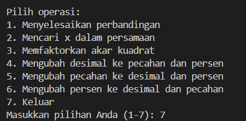
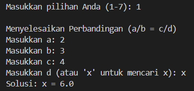
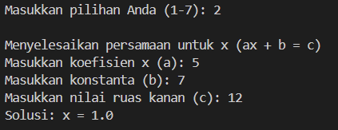
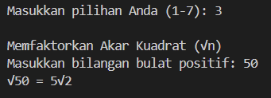
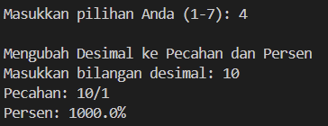
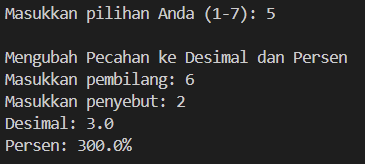
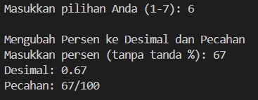
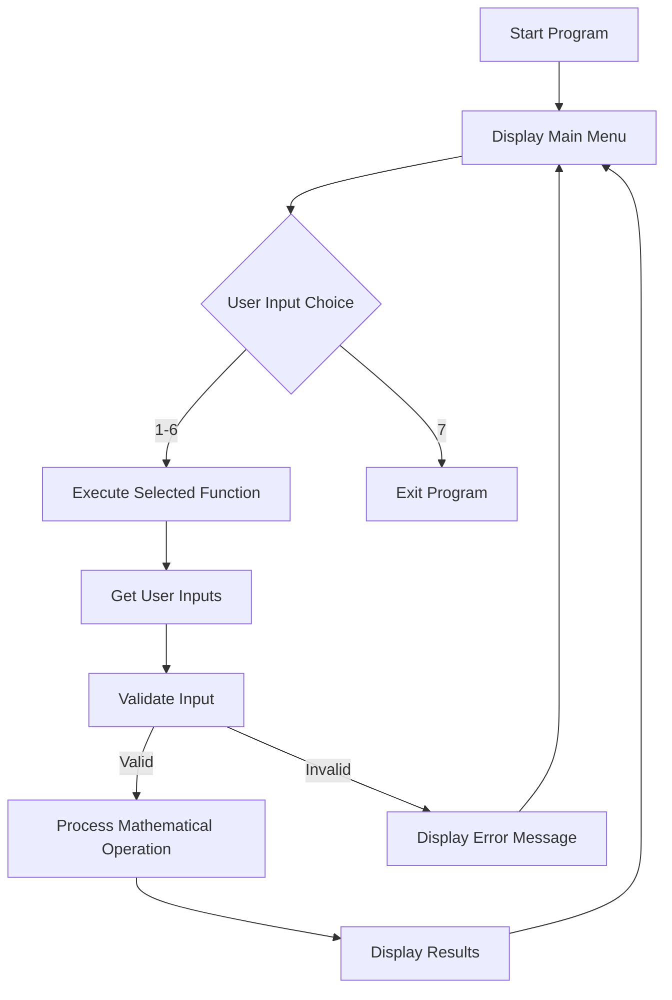

# 🧮 Kalkulator Multi-Fungsi

<div align="center">

[](https://www.python.org/)
[](LICENSE)


[](https://www.freecodecamp.org/certification/chrisimana/college-algebra-with-python-v8)

</div>

## 📋 Deskripsi Proyek

**Kalkulator Multi Fungsi** adalah aplikasi kalkulator serbaguna berbasis terminal (Command Line Interface) yang dibangun dengan Python untuk menyelesaikan berbagai masalah matematika. Proyek ini bertujuan menyediakan alat bantu hitung yang cepat, akurat, dan mudah digunakan untuk operasi seperti menyelesaikan perbandingan, mencari nilai variabel dalam persamaan linear, menyederhanakan akar kuadrat, serta melakukan konversi antara desimal, pecahan, dan persen. 

## 📑 Daftar Isi

- [Deskripsi Proyek](#-deskripsi-proyek)
- [Demo Program](#-demo-program)
- [Tampilan Aplikasi](#-tampilan-aplikasi)
- [Latar Belakang](#-latar-belakang)
- [Fitur Utama](#-fitur-utama)
- [Teknologi yang Digunakan](#-teknologi-yang-digunakan)
- [Arsitektur](#-arsitektur)
- [Struktur Proyek](#-struktur-proyek)
- [Cara Instalasi](#-cara-instalasi)
- [Cara Penggunaan](#-cara-penggunaan)
- [Peran Developer](#-peran-developer)
- [Pembelajaran dari Proyek](#-pembelajaran-dari-proyek-lessons-learned)
- [Ucapan Terima Kasih](#-ucapan-terima-kasih--acknowledgement)

## 🎮 Demo Program

*(Coming Soon)*

## 📸 Tampilan Aplikasi

**Awal CLI**




**Menyelesaikan Perbandingan:**




**Mencari x dalam persamaan:**




**Memfaktorkan Akar Kuadrat:**




**Mengubah desimal ke pecahan dan persen:**




**Mengubah pecahan ke desimal dan persen:**




**Mengubah persen ke desimal dan pecahan:**




## 🎯 Latar Belakang

Proyek ini dibuat untuk memenuhi kebutuhan akan alat bantu hitung sederhana namun serbaguna yang dapat diakses dengan cepat melalui terminal. Motivasi utamanya adalah:

- **Menggabungkan fungsi-fungsi matematika yang sering digunakan** ke dalam satu program ringkas
- **Menyediakan antarmuka yang mudah digunakan** tanpa perlu aplikasi kalkulator terpisah
- **Membantu pembelajaran matematika** dengan memberikan solusi langkah demi langkah
- **Portabilitas tinggi** - dapat dijalankan di perangkat mana pun yang memiliki Python
- **Edukasi pemrograman** - sebagai contoh implementasi logika matematika dalam kode Python

Selain itu, proyek ini juga dibuat sebagai salah satu persyaratan untuk memperoleh sertifikat dari platform pembelajaran online freeCodeCamp, sehingga sekaligus menjadi bagian dari proses pembelajaran dan pengembangan portofolio pemrograman.

## 🌟 Fitur Utama

### 🧮 Fungsi Matematika Dasar
- **Penyelesaian Perbandingan** - Menyelesaikan `a/b = c/d` untuk variabel x atau memverifikasi kebenaran proporsi
- **Penyelesaian Persamaan Linear** - Menyelesaikan `ax + b = c` untuk mencari nilai x
- **Penyederhanaan Akar Kuadrat** - Memfaktorkan √n ke dalam bentuk `a√b` yang lebih sederhana

### 🔄 Fitur Konversi
- **Desimal → Pecahan & Persen** - Mengubah bilangan desimal ke bentuk pecahan dan persentase
- **Pecahan → Desimal & Persen** - Mengubah pecahan ke bentuk desimal dan persentase
- **Persen → Desimal & Pecahan** - Mengubah persentase ke bentuk desimal dan pecahan

### 🛡️ Fitur Pendukung
- **Input Validation** - Validasi input untuk mencegah error (pembagian dengan nol, input tidak valid)
- **Error Handling** - Penanganan exception yang robust agar program tidak crash
- **User-Friendly Prompts** - Petunjuk input yang jelas dan mudah dipahami
- **Interactive Menu** - Menu interaktif dengan navigasi mudah

## 🛠️ Teknologi yang Digunakan

- **Python 3.7+** - Bahasa pemrograman utama
- **SymPy** - Library untuk komputasi simbolik matematika (diimpor untuk pengembangan future)
- **Math** - Library bawaan Python untuk fungsi matematika
- **Fractions** - Library bawaan Python untuk menangani operasi pecahan

## 🏗️ Arsitektur

### Workflow Diagram



### Algoritma Utama

| Fungsi | Algoritma | Kompleksitas |
|------|------|-------------|
| **Penyelesaian Perbandingan** | Perkalian silang: jika d='x', x=(b*c)/a; else validasi a*d == b*c | O(1) |
| **Penyelesaian Persamaan** | Jika a=0: cek infinite solutions; else x=(c-b)/a | O(1) |
| **Faktorisasi Akar** | Cari faktor kuadrat sempurna terbesar dari n dengan iterasi menurun | O(√n) |
| **Konversi Desimal** | Fraction(desimal).limit_denominator() untuk pecahan, desimal*100 untuk persen | O(log n) |

## 📁 Struktur Proyek

```
kalkulator-multi-fungsi/
│
├── Screenshot/
│   ├── 1.png
│   ├── 2.png
│   ├── 3.png
│   ├── 4.png
│   ├── 5.png
│   ├── 6.png
│   └── 7.png 
│
├── src/
│   └── main.py              
│
├── LICENSE.md              
└── README.md              

```

### Penjelasan File

| File / Folder         | Fungsi                                                                                     |
| --------------------- | ------------------------------------------------------------------------------------------ |
| `src/main.py`         | Berisi kode utama program kalkulator multi fungsi termasuk logika perhitungan dan menu CLI |
| `Screenshot/`         | Folder yang berisi gambar tampilan program sebagai dokumentasi penggunaan                  |
| `1.png-7.png`         | Tampilan Aplikasi/Program kalkulator                                                       |
| `README.md`           | Dokumentasi lengkap proyek                                                                 |
| `LICENSE.md`          | File lisensi proyek (MIT License)                                                          |


## 📥 Cara Instalasi

### Prasyarat

- Python 3.7 atau lebih tinggi
- Pip (Python package installer)

### Langkah-langkah Instalasi

1. **Clone Repository**
   ```bash
   git clone https://github.com/Chrisimana/kalkulator-multi-fungsi
   cd kalkulator-multi-fungsi
   ```

2. **Install Dependencies**
   ```bash
   pip install sympy
   ```

3. **Jalankan Aplikasi**
   ```bash
   python src/main.py
   ```

## 🎮 Cara Penggunaan

### Menjalankan Aplikasi

```bash
python src/main.py
```

### Navigasi Menu

1. **Memilih Operasi**
   - Masukkan angka **1-6** untuk memilih fungsi matematika
   - Masukkan angka **7** untuk keluar dari program

2. **Input Data**
   - Ikuti petunjuk input yang ditampilkan
   - Masukkan angka sesuai permintaan
   - Untuk fitur perbandingan, Anda dapat memasukkan 'x' sebagai variabel yang dicari

3. **Melihat Hasil**
   - Hasil perhitungan akan langsung ditampilkan
   - Program akan kembali ke menu utama setelah selesai

### Panduan Per Fitur

| Fitur | Cara Penggunaan | Contoh Input |
|------|-----------------|--------------|
| **Perbandingan** | Masukkan a, b, c, dan d (atau 'x' untuk mencari) | a=2, b=3, c=4, d='x' → x=6 |
| **Persamaan Linear** | Masukkan a, b, c dari ax + b = c | a=2, b=5, c=11 → x=3 |
| **Akar Kuadrat** | Masukkan bilangan positif n | n=50 → 5√2 |
| **Konversi Desimal** | Masukkan bilangan desimal | 0.75 → 3/4, 75% |
| **Konversi Pecahan** | Masukkan pembilang dan penyebut | 3/8 → 0.375, 37.5% |
| **Konversi Persen** | Masukkan persen (tanpa %) | 25 → 0.25, 1/4 |

### Shortcuts

| Aksi | Cara |
|------|------|
| Pilih operasi | Masukkan angka 1-7 |
| Input variabel | Masukkan 'x' untuk nilai yang dicari |
| Keluar | Pilih opsi 7 atau tekan Ctrl+C |
| Ulang operasi | Program otomatis kembali ke menu |

## 👨‍💻 Peran Developer

Sebagai pengembang tunggal proyek ini, saya bertanggung jawab atas:

- **Perancangan Sistem** - Mendesain arsitektur aplikasi dan alur menu
- **Pengembangan Backend** - Menulis seluruh logika perhitungan matematika dalam Python
- **Implementasi Algoritma** - Menerjemahkan rumus matematika ke dalam kode program
- **Error Handling** - Membuat sistem penanganan exception yang robust
- **User Experience** - Mendesain antarmuka CLI yang ramah pengguna
- **Pengujian** - Melakukan uji coba pada setiap fungsi untuk memastikan akurasi
- **Dokumentasi** - Membuat dokumentasi proyek yang jelas dan mudah dipahami

## 📚 Pembelajaran dari Proyek (Lessons Learned)

Selama pengembangan proyek ini, saya mempelajari:

### Technical Skills
- **Implementasi Logika Matematika** - Cara menerjemahkan rumus matematika seperti perkalian silang dan faktorisasi akar ke dalam kode Python
- **Penggunaan Library Bawaan** - Memanfaatkan modul `math`, `fractions.Fraction`, dan penanganan `exception`
- **Algoritma Faktorisasi** - Mengembangkan algoritma untuk mencari faktor kuadrat sempurna terbesar
- **Penanganan Error** - Mengantisipasi input tidak valid (pembagian nol, tipe data salah)

### Soft Skills
- **Desain CLI yang Ramah Pengguna** - Membuat alur interaksi yang intuitif
- **Problem Solving** - Memecahkan masalah matematika ke dalam langkah-langkah algoritmik
- **Code Organization** - Menstruktur kode dengan fungsi-fungsi yang terpisah dan reusable


## 🙏 Ucapan Terima Kasih

Terima kasih kepada semua pihak yang telah membantu dalam pengembangan proyek ini:

- **FreeCodeCamp** - Atas kurikulum dan inspirasi proyek
- **Python Community** - Atas dokumentasi dan library yang luar biasa
- **SymPy Developers** - Atas library komputasi simbolik yang powerful
- **Shields.io** - Atas layanan badges yang keren
- **Pengguna** - Yang menggunakan dan memberikan feedback untuk proyek ini

### Referensi

- [Python Documentation](https://docs.python.org/3/)
- [SymPy Documentation](https://docs.sympy.org/)
- [Fractions Module](https://docs.python.org/3/library/fractions.html)
- [Math Module](https://docs.python.org/3/library/math.html)

---

<div align="center">

**⭐ Jika proyek ini bermanfaat, jangan lupa berikan bintang di GitHub! ⭐**

</div>