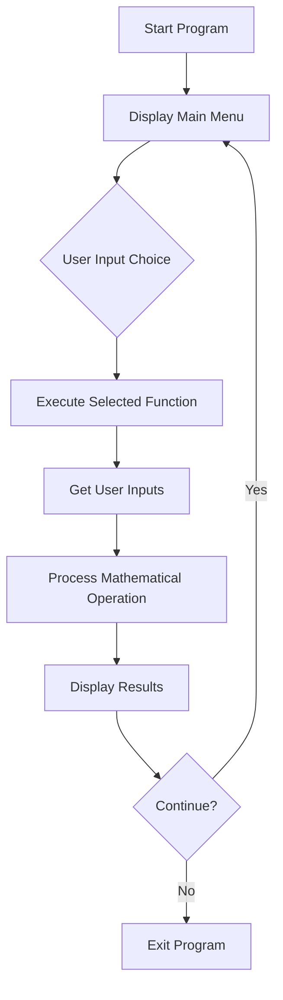

# 🧮 Multi-Function Calculator

<div align="center">


**Kalkulator multi-fungsi untuk menyelesaikan berbagai masalah matematika - Project Pelatihan FreeCodeCamp**

[Fitur](#-fitur) • [Instalasi](#-instalasi) • [Penggunaan](#-penggunaan) • [Dokumentasi](#-dokumentasi)

</div>

## 📋 Daftar Isi

- [Gambaran Umum](#-gambaran-umum)
- [Fitur](#-fitur)
- [Instalasi](#-instalasi)
- [Penggunaan](#-penggunaan)
- [Dokumentasi](#-dokumentasi)
- [Contoh Penggunaan](#-contoh-penggunaan)
- [FAQ](#-faq)

## 🚀 Gambaran Umum

**Multi-Function Calculator** adalah aplikasi kalkulator serbaguna yang dibangun dengan Python untuk menyelesaikan berbagai jenis masalah matematika. Aplikasi ini dikembangkan sebagai bagian dari syarat lulus pelatihan FreeCodeCamp dan menyediakan antarmuka command-line yang sederhana namun powerful dengan berbagai fungsi matematika yang berguna untuk siswa, guru, dan profesional.

### ✨ Highlights

- 🎯 **Multiple Functions** - Enam fungsi matematika berbeda dalam satu aplikasi
- 🧮 **Proportion Solver** - Menyelesaikan dan memverifikasi proporsi
- 🔢 **Equation Solver** - Menyelesaikan persamaan linear
- 📐 **Square Root Simplifier** - Menyederhanakan bentuk akar kuadrat
- 🔄 **Conversion Tools** - Konversi antara desimal, pecahan, dan persen
- 🛡️ **Error Handling** - Penanganan error yang robust untuk input tidak valid
- 🎓 **Educational Purpose** - Cocok untuk pembelajaran matematika dan programming

## 🌟 Fitur

### 🤖 Core Features
- **Penyelesaian Proporsi** - Menyelesaikan `a/b = c/d` untuk variabel x
- **Penyelesaian Persamaan** - Menyelesaikan persamaan linear `ax + b = c`
- **Penyederhanaan Akar** - Memfaktorkan bilangan menjadi bentuk akar sederhana
- **Multiple Responses** - Berbagai format output yang informatif

### 🛠️ Utility Features
- **🧮 Decimal Conversion** - Konversi desimal ke pecahan dan persentase
- **📊 Fraction Conversion** - Konversi pecahan ke desimal dan persentase
- **📈 Percent Conversion** - Konversi persen ke desimal dan pecahan
- **🔍 Input Validation** - Validasi input untuk mencegah error

### 💾 Data Management
- **Real-time Processing** - Pemrosesan langsung tanpa penyimpanan data
- **Error Prevention** - Penanganan division by zero dan input invalid
- **User-Friendly Prompts** - Petunjuk input yang jelas dan mudah dimengerti

### 🎨 CLI Features
- **Clean Interface** - Antarmuka command-line yang bersih dan terorganisir
- **Interactive Menu** - Menu interaktif dengan navigasi mudah
- **Clear Instructions** - Instruksi yang jelas untuk setiap operasi
- **Immediate Feedback** - Hasil perhitungan yang langsung ditampilkan

## 📥 Instalasi

### Prerequisites

- Python 3.7 atau lebih tinggi
- Library standar Python (math, fractions, sympy)

### Step-by-Step Installation

1. **Download Script**
   ```bash
   # Download file Python calculator.py
   ```

2. **Verifikasi Dependencies**
   ```bash
   python -c "import math, fractions, sympy; print('Dependencies OK')"
   ```

3. **Run Application**
   ```bash
   python calculator.py
   ```

### Quick Install
```bash
# Langsung jalankan file
python multi_function_calculator.py
```

## 🎮 Penggunaan

### Menjalankan Aplikasi

```bash
python calculator.py
```

### Basic Usage

1. **Memilih Operasi**
   - Pilih nomor 1-6 untuk fungsi matematika yang diinginkan
   - Pilih 7 untuk keluar dari program
   - Ikuti petunjuk input yang ditampilkan

2. **Fitur Matematika**
   ```
   1. Solve proportions (a/b = c/d)
   2. Solve for x in equations (ax + b = c)  
   3. Factor square roots (√n)
   4. Convert decimals to fractions and percents
   5. Convert fractions to decimals and percents
   6. Convert percents to decimals and fractions
   ```

3. **Input Format**
   - Untuk proporsi: masukkan nilai a, b, c, dan 'x' untuk variabel
   - Untuk persamaan: masukkan koefisien a, konstanta b, dan nilai c
   - Untuk konversi: masukkan nilai dalam format yang diminta

### Keyboard Shortcuts

| Action | Method |
|--------|--------|
| Pilih operasi | Masukkan angka 1-7 |
| Input nilai | Masukkan angka atau 'x' untuk variabel |
| Keluar aplikasi | Pilih opsi 7 |

## 📚 Dokumentasi

### Workflow Diagram



### Function Descriptions

| Function | Description |
|------|-------------|
| `solve_proportion()` | Menyelesaikan proporsi a/b = c/d untuk x atau memverifikasi kebenaran proporsi |
| `solve_for_x()` | Menyelesaikan persamaan linear ax + b = c untuk variabel x |
| `factor_square_root()` | Menyederhanakan bentuk akar kuadrat √n menjadi a√b |
| `decimal_conversion()` | Mengkonversi desimal ke bentuk pecahan dan persentase |
| `fraction_conversion()` | Mengkonversi pecahan ke bentuk desimal dan persentase |
| `percent_conversion()` | Mengkonversi persentase ke bentuk desimal dan pecahan |
| `main()` | Mengontrol alur program utama dan menampilkan menu |

### Mathematical Algorithms

**Proporsi Solver:**
```python
if d == 'x':
    x = (b * c) / a
else:
    result = (a * d) == (b * c)
```

**Equation Solver:**
```python
if a == 0:
    if b == c: infinite solutions
    else: no solution
else:
    x = (c - b) / a
```

**Square Root Simplifier:**
```python
for i from sqrt(n) down to 1:
    if n % (i*i) == 0:
        simplified = i√(n/(i*i))
```

## 💡 Contoh Penggunaan

### Basic Operation
```
Multi-Function Calculator
=========================

Select an operation:
1. Solve proportions
2. Solve for x in equations
3. Factor square roots
4. Convert decimals to fractions and percents
5. Convert fractions to decimals and percents
6. Convert percents to decimals and fractions
7. Exit

Enter your choice (1-7): 1

Solving Proportions (a/b = c/d)
Enter a: 2
Enter b: 3
Enter c: 4
Enter d (or 'x' to solve for x): x
Solution: x = 6.0
```

### Advanced Features
```
Enter your choice (1-7): 2

Solving for x in equations (ax + b = c)
Enter coefficient of x (a): 2
Enter constant term (b): 5
Enter right side value (c): 11
Solution: x = 3.0

Enter your choice (1-7): 3

Factoring Square Roots (√n)
Enter a positive integer: 50
√50 = 5√2
```

### Conversion Examples
```
Enter your choice (1-7): 4

Converting Decimals to Fractions and Percents
Enter a decimal number: 0.75
Fraction: 3/4
Percent: 75.0%

Enter your choice (1-7): 5

Converting Fractions to Decimals and Percents
Enter numerator: 3
Enter denominator: 8
Decimal: 0.375
Percent: 37.5%

Enter your choice (1-7): 6

Converting Percents to Decimals and Fractions
Enter a percent (without % sign): 25
Decimal: 0.25
Fraction: 1/4
```

## ❓ FAQ

### Q: Apakah perlu install library tambahan?
**A:** Tidak! Kalkulator ini menggunakan pure Python standard library saja (math, fractions, sympy).

### Q: Bagaimana cara menyelesaikan proporsi dengan variabel?
**A:** Masukkan 'x' untuk nilai d yang tidak diketahui, sistem akan menghitung secara otomatis.

### Q: Apa yang terjadi jika memasukkan denominator nol?
**A:** Program akan mendeteksi dan menampilkan error "Denominator cannot be zero".

### Q: Bagaimana format input untuk persentase?
**A:** Masukkan angka tanpa simbol % (contoh: 25 untuk 25%).

### Q: Apakah program ini cocok untuk pembelajaran matematika?
**A:** Sangat cocok! Program ini dirancang untuk membantu memahami konsep proporsi, persamaan, dan konversi numerik.

### Q: Bisakah menangani bilangan negatif?
**A:** Untuk square roots hanya menerima positive integer. Operasi lain bisa menangani bilangan negatif.

---

<div align="center">

**⭐ Jangan lupa beri bintang jika project ini membantu! ⭐**

</div>